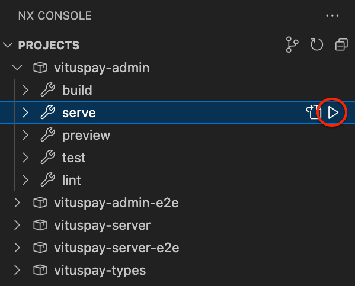

# VitusVet Nx Monorepo Example

## About

The goal of this workspace is to show an example monorepo setup for modern TypeScript development using Nx.

Developer experience and type safety throughout the stack are primary concerns so the workspace has been setup to enable that by sharing types via workspace libraries.

To learn more about this style of Nx workspace, a so-called "integrated repo", visit the [getting started with integrated repos page](https://nx.dev/getting-started/integrated-repo-tutorial).

For more information on Nx generally read [the docs](https://nx.dev/getting-started/intro).

### Nx Alternatives

There are alternatives to Nx that may be worth exploring. Currently, the most popular alternative in the TypeScript space is Turborepo from Vercel (the creators of NextJS). You can learn more about Turborepo [here](https://turbo.build/repo).

## Getting started

### Init task

There is a VC Code task `init` that will take all the steps necessary to start the project. Note that this may include deleting and/or creating files and folders.

You will find more details in the sections below about what the `init` task does.

See the section called "Tasks" below for more information on VS Code tasks generally.

### VPN

If any project needs to connect to a SQL database you will need to be on the VitusVet VPN.

### AWS credentials

You will need the correct AWS credentials to run backend applications locally and interact with AWS services.

Your credentials must be stored in a named profile on your machine and referenced in a .env file so that application can access them at run time.

Ensure you have a .env file in your root directory with `AWS_PROFILE=dev` or whatever name you use for the profile with your dev credentials.

Note that the `init` task will create the .env file for you with `AWS_PROFILE=dev`.

Running frontend applications does not require credentials but you won't be able to pull any data from our databases.

### Use the correct version of Node

This project has a .nvmrc file that lists the current version of Node being used throughout.

If you are using NVM you can run `nvm use` to ensure you have the correct version of node. Alternatively you can add a script to your shell profile to auto switch versions of Node when a .nvmrc file is found.

### Install Node modules

In this style of Nx monorepo there is only 1 package.json file at the root of the project.

You can either install Node modules manually or use the `init` task.

- Run the `init` task
- Alternatively run `npm i` in the root directory

### Nx Console

The Nx Console for VS Code is an easy way to get started with the project. It is highly recommended that you install the extension. You can find suggested extensions at any time under .vscode > extensions.json.



### Tasks

As an alternative to the Nx console there are also several VS Code tasks you can run to get started.

See [this doc](https://vitusvet.atlassian.net/wiki/spaces/PD/pages/2284978177/How+to+run+VS+Code+tasks) for more on how to run tasks in VS Code.

### Nx CLI

You can also use the Nx CLI to do anything you can do in the Nx Console and more. You can install globally or use `npx` like in the examples below.

Common commands to get you started are:

```sh
# Start the dev server for a specific project
npx nx serve SOME_PROJECT_NAME

# Start the test server for a specific project
npx nx test SOME_PROJECT_NAME

# Test all projects
npx nx run-many --target=test

# Build all project
npx nx run-many --target=build
```
